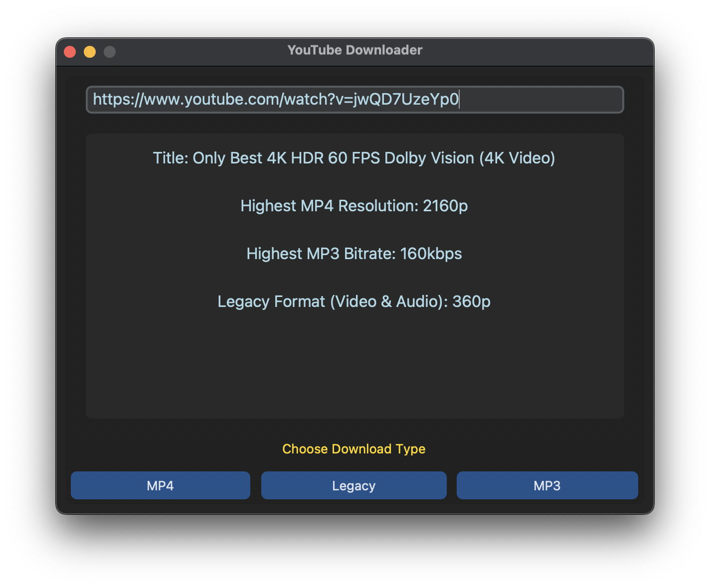
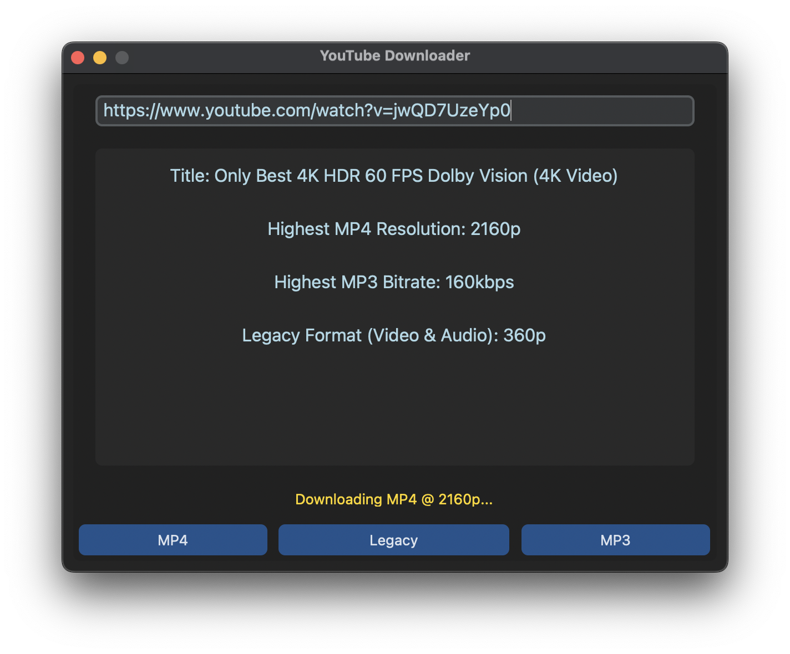
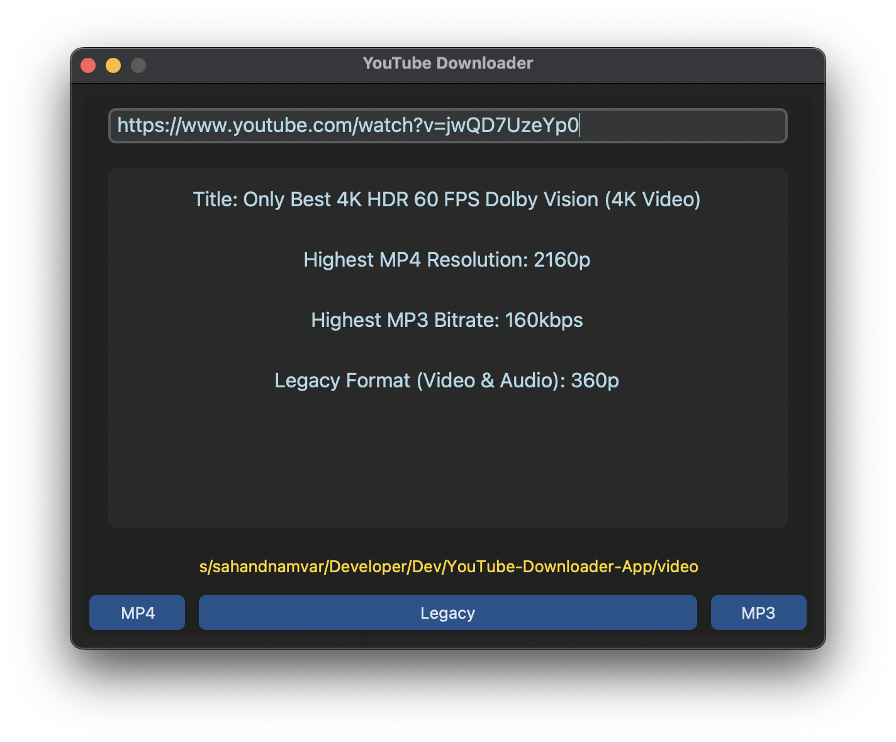

# YouTube Downloader

**YouTube Downloader** is a desktop application designed to help users download high-quality video and audio from YouTube. It supports downloading video and audio separately for editing or combined into a single file for legacy formats. This application is compatible with both Mac and Windows platforms.

## Why this app?

I created this app to address the common need for downloading and saving video and audio from YouTube. While there are several good options available, most fall short in some way. Many websites don’t function properly, and often you either have to pay for the best quality or settle for lower resolution streams. My goal was to offer a straightforward solution that lets you download high-quality video (up to 4K) and audio with ease, without any hassle. This app is also great for downloading MP3s for audio and music without the video.

## Features

- **High-Quality Downloads:** Retrieve video in up to 4K resolution and audio in high fidelity for professional use.
- **Legacy Format Support:** Download video and audio combined into a single file at 720p or lower resolution.
- **Intuitive Interface:**  A user-friendly graphical interface with straightforward instructions and feedback.

## Usage

`YT-Downloader-V1.py` is an alternative to `YT-Downloader-V2.py`. While the core functionality is similar, `YT-Downloader-V2.py` is written using Object-Oriented Programming (OOP) for macOS, whereas `YT-Downloader-V1.py` employs a more procedural and functional approach for Windows. To use the app, run the appropriate `.py` file in your terminal or console (ensure all dependencies are installed). Alternatively, you can use `pyinstaller` to create a standalone executable of the app.

**To download a video:**

1. Open the app.
2. Paste the URL of the video into the input field and press Enter.
3. Choose your desired download type from the options provided.
4. The file(s) will be saved in the same directory as the executable.
5. Once the download is complete, the app will display the directory containing the downloaded file(s), and you can open it directly from the application.

    
     
    <i>Paste URL, review details, choose download type</i>
      
    
     
    <i>File is downloading...</i>
      
    
     
    <i>File is downloaded. Click on the shown file path to open in window</i>

## Documentation

For further technical details, please review the source code, which includes comprehensive comments.